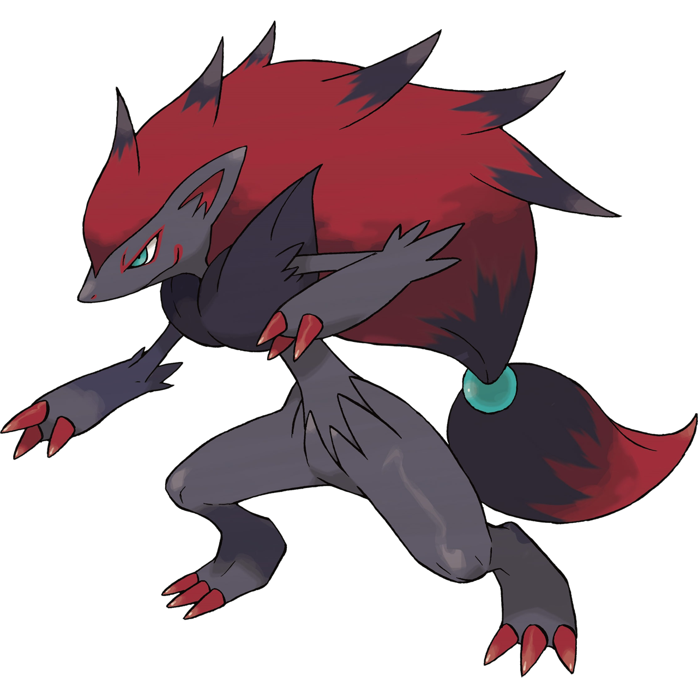

```{r setup, include=FALSE}
knitr::opts_chunk$set(echo = TRUE, message = FALSE,
                      warning = FALSE)
```
```{r}
library(corrplot)
library(glmnet)
library(tidyverse)
library(tidymodels)
library(ISLR)
library(ggplot2)
library(dplyr)
library(janitor)
library(randomForest)
library(xgboost)
library(vip)
library(rpart.plot)
library(ranger)
```
## Tree-Based Models

For this assignment, we will continue working with the file `"pokemon.csv"`, found in `/data`. The file is from Kaggle: <https://www.kaggle.com/abcsds/pokemon>.

The [Pokémon](https://www.pokemon.com/us/) franchise encompasses video games, TV shows, movies, books, and a card game. This data set was drawn from the video game series and contains statistics about 721 Pokémon, or "pocket monsters." In Pokémon games, the user plays as a trainer who collects, trades, and battles Pokémon to (a) collect all the Pokémon and (b) become the champion Pokémon trainer.

Each Pokémon has a [primary type](https://bulbapedia.bulbagarden.net/wiki/Type) (some even have secondary types). Based on their type, a Pokémon is strong against some types, and vulnerable to others. (Think rock, paper, scissors.) A Fire-type Pokémon, for example, is vulnerable to Water-type Pokémon, but strong against Grass-type.

{width="200"}

The goal of this assignment is to build a statistical learning model that can predict the **primary type** of a Pokémon based on its generation, legendary status, and six battle statistics.

**Note: Fitting ensemble tree-based models can take a little while to run. Consider running your models outside of the .Rmd, storing the results, and loading them in your .Rmd to minimize time to knit.**

### Exercise 1

Read in the data and set things up as in Homework 5:

- Use `clean_names()`
- Filter out the rarer Pokémon types
- Convert `type_1` and `legendary` to factors

Do an initial split of the data; you can choose the percentage for splitting. Stratify on the outcome variable.

Fold the training set using *v*-fold cross-validation, with `v = 5`. Stratify on the outcome variable.

Set up a recipe to predict `type_1` with `legendary`, `generation`, `sp_atk`, `attack`, `speed`, `defense`, `hp`, and `sp_def`:

- Dummy-code `legendary` and `generation`;
- Center and scale all predictors.
```{r}
Pokemon <- read.csv("C:\\Users\\Jonat\\OneDrive\\schoolwork\\PSTAT 131\\HW\\HW 6\\PSTAT-131-HW6\\Pokemon.csv")
Pokemon <- Pokemon %>%
  clean_names()
head(Pokemon)

Common_pokemon_types <- Pokemon %>%
   filter(type_1 == "Bug" | type_1 == "Fire" | type_1 == "Grass" | type_1 == "Normal" | type_1 == "Water" | type_1 == "Psychic")
Common_pokemon_types %>%
  group_by(type_1) %>%
  summarise(count = n()) %>%
  arrange(desc(count)) #Now there are only 6 common types

Pokemon_factored <- Common_pokemon_types %>%
  mutate(type_1 = factor(type_1)) %>%
  mutate(legendary = factor(legendary)) %>%
  mutate(generation = factor(generation))
head(Pokemon_factored)

set.seed(3515)
Pokemon_split <- initial_split(Pokemon_factored, strata = type_1, prop = 0.7)
Pokemon_training <- training(Pokemon_split)
Pokemon_testing <- testing(Pokemon_split)
dim(Pokemon_training) #318 observations
dim(Pokemon_testing) #140 observations

Pokemon_fold <- vfold_cv(Pokemon_training, strata = type_1, v = 5)
Pokemon_fold

Pokemon_recipe <- recipe(type_1 ~ legendary + generation + sp_atk + attack + speed + defense + hp + sp_def, data = Pokemon_training) %>%
  step_dummy(legendary) %>%
  step_dummy(generation) %>%
  step_scale(all_predictors())
```

### Exercise 2

Create a correlation matrix of the training set, using the `corrplot` package. *Note: You can choose how to handle the continuous variables for this plot; justify your decision(s).*

What relationships, if any, do you notice? Do these relationships make sense to you?
```{r}
cor_Pokemon <- Pokemon_training %>%
  select_if(is.numeric) %>%
  cor(use = "complete.obs") %>%
  corrplot(type = "lower", diag = FALSE)
```
I have decided to use only the numeric values because the numeric values are the stat values for each Pokemon. Which I believe is important to figuring out the Model_1 type. Total has a strong positive correlation with all the values. This makes sense to me because Total is all the stats added up. I would say that the other correlations that are worth noting is the correlation between sp_def and defense and between attack and sp_attack. This makes sense to me because there are most likely Pokemon that focus on an attack based strategy,high sp_attack and high attack, and Pokemon that focus on a defense type strategy,high sp_defense and high defense.

### Exercise 3

First, set up a decision tree model and workflow. Tune the `cost_complexity` hyperparameter. Use the same levels we used in Lab 7 -- that is, `range = c(-3, -1)`. Specify that the metric we want to optimize is `roc_auc`. 

Print an `autoplot()` of the results. What do you observe? Does a single decision tree perform better with a smaller or larger complexity penalty?
```{r}
tree_spec <-decision_tree() %>%
  set_engine("rpart")

class_tree_spec <- tree_spec %>%
  set_mode("classification")
  
class_tree_wf <- workflow() %>%
  add_model(class_tree_spec %>% set_args(cost_complexity = tune())) %>%
  add_recipe(Pokemon_recipe)

set.seed(3515)

param_grid <- grid_regular(cost_complexity(range = c(-3, -1)), levels = 10)

tune_res <- tune_grid(
  class_tree_wf,
  resamples = Pokemon_fold,
  grid = param_grid,
  metrics = metric_set(roc_auc)
)
autoplot(tune_res)
```
Based on the plot we can say that the roc_auc increases slightly as the cost_complexity increases. After it reaches it's peak the roc-auc decreases dratically. We can conclude that it performs better with a larger complexity penalty. But after a certain point, it no longer performs better.

### Exercise 4

What is the `roc_auc` of your best-performing pruned decision tree on the folds? *Hint: Use `collect_metrics()` and `arrange()`.*
```{r}
tree_roc_auc <- collect_metrics(tune_res) %>%
  arrange(-mean) %>%
  head()
tree_roc_auc
```
The best roc_auc value is 0.633. 

### Exercise 5

Using `rpart.plot`, fit and visualize your best-performing pruned decision tree with the *training* set.
```{r}
best_complexity <- select_best(tune_res)
class_tree_final <- finalize_workflow(class_tree_wf, best_complexity)
class_tree_final_fit <- fit(class_tree_final, data = Pokemon_training)

class_tree_final_fit %>%
  extract_fit_engine() %>%
  rpart.plot()
```

### Exercise 5 (continued)

Now set up a random forest model and workflow. Use the `ranger` engine and set `importance = "impurity"`. Tune `mtry`, `trees`, and `min_n`. Using the documentation for `rand_forest()`, explain in your own words what each of these hyperparameters represent.

Create a regular grid with 8 levels each. You can choose plausible ranges for each hyperparameter. Note that `mtry` should not be smaller than 1 or larger than 8. **Explain why not. What type of model would `mtry = 8` represent?**
```{r}
forest_spec <- rand_forest() %>%
  set_engine("ranger", importance = "impurity") %>%
  set_mode("classification")

forest_wf <- workflow() %>%
  add_model(forest_spec %>% 
  set_args(mtry = tune(), trees = tune(), min_n = tune())) %>%
  add_recipe(Pokemon_recipe)

set.seed(3515)
              
multi_param_grid <- grid_regular(mtry(range = c(1,8)), trees(range(1,200)), min_n(range(1,30)), levels = 8)

multi_tune_res <- tune_grid(
  forest_wf, resamples = Pokemon_fold, grid = multi_param_grid, metrics = metric_set(roc_auc) 
)
```
mtry = The number of predictors that will be randomly sampled with each split of the tree models.
trees = The number of trees in the tree model.
min_n = minimum number of points in a group to make a split.

It has to range from 1 to 8 because we cannot have 0 predictors and we only have a total of 8 predictors. If we use 8, we would get a bagging model.

### Exercise 6

Specify `roc_auc` as a metric. Tune the model and print an `autoplot()` of the results. What do you observe? What values of the hyperparameters seem to yield the best performance?
```{r}
autoplot(multi_tune_res)
```
From the plot we can see that 1 tree has low performance. The roc_auc increases as with the # of trees. Based on the plots we can also see that 200 trees has overall the highest roc_auc. As the node size increases, there are not much difference.

### Exercise 7

What is the `roc_auc` of your best-performing random forest model on the folds? *Hint: Use `collect_metrics()` and `arrange()`.*
```{r}
collect_metrics(multi_tune_res) %>% 
  arrange(-mean) %>%
  head()

best_forest_model <- select_best(multi_tune_res, metric = "roc_auc")
```
Best model has a roc_auc value of 0.714.

### Exercise 8

Create a variable importance plot, using `vip()`, with your best-performing random forest model fit on the *training* set.

Which variables were most useful? Which were least useful? Are these results what you expected, or not?
```{r}
best_model_final <- finalize_workflow(forest_wf, best_forest_model)
best_model_final_fit <- fit(best_model_final, data = Pokemon_training)
best_model_final_fit %>%
  extract_fit_engine() %>%
  vip()
```
The variables that are most useful to us are sp_atk, defense, hp, speed, attack, and sp_def. This makes sense because there variables are stats of the pokemon. The generation they are from and whether it is legendary makes sense that they are not important.

### Exercise 9

Finally, set up a boosted tree model and workflow. Use the `xgboost` engine. Tune `trees`. Create a regular grid with 10 levels; let `trees` range from 10 to 2000. Specify `roc_auc` and again print an `autoplot()` of the results. 

What do you observe?

What is the `roc_auc` of your best-performing boosted tree model on the folds? *Hint: Use `collect_metrics()` and `arrange()`.*
```{r}
boost_spec <- boost_tree() %>%
  set_engine("xgboost") %>%
  set_mode("classification")
boost_wf <- workflow() %>%
  add_model(boost_spec %>%
              set_args(trees = tune())) %>%
  add_recipe(Pokemon_recipe)

set.seed(3515)

boost_grid <- grid_regular(trees(range = c(10,2000)), levels = 10)

boost_tune_res <- tune_grid(
  boost_wf,
  resamples = Pokemon_fold,
  grid = boost_grid,
  metrics = metric_set(roc_auc)
)

autoplot(boost_tune_res)

collect_metrics(boost_tune_res) %>% 
  arrange(-mean) %>%
  head()
best_boost_final <- select_best(boost_tune_res)
best_boost_final_model <- finalize_workflow(boost_wf, best_boost_final)
best_boost_final_model_fit <- fit(best_boost_final_model, data = Pokemon_training)
```
The roc_auc constantly decreases as you increase the amount of trees. Best model has a roc_auc value of 0.684.

### Exercise 10

Display a table of the three ROC AUC values for your best-performing pruned tree, random forest, and boosted tree models. Which performed best on the folds? Select the best of the three and use `select_best()`, `finalize_workflow()`, and `fit()` to fit it to the *testing* set. 

Print the AUC value of your best-performing model on the testing set. Print the ROC curves. Finally, create and visualize a confusion matrix heat map.

Which classes was your model most accurate at predicting? Which was it worst at?
```{r}
pruned_roc_auc <- collect_metrics(tune_res) %>%
  arrange(-mean) %>%
  head()
forest_roc_auc <- collect_metrics(multi_tune_res) %>%
  arrange(-mean) %>%
  head()
boost_roc_auc <- collect_metrics(boost_tune_res) %>%
  arrange(-mean) %>%
  head()

roc_auc_means <- c(pruned_roc_auc$mean[1], forest_roc_auc$mean[1], boost_roc_auc$mean[1])
Models <- c("Pruned Tree", "Random Forest", "Boosted Tree")
Total <- tibble(roc_auc = roc_auc_means, models = Models)
Total

#The random forest model performed the best between the three.

best_tree <- select_best(multi_tune_res)
best_tree_model <- finalize_workflow(forest_wf, best_forest_model)
best_tree_model_fit <- fit(best_tree_model, data = Pokemon_testing)

prediction <- augment(best_boost_final_model_fit, new_data = Pokemon_testing) %>%
  select(type_1, 
         .pred_class,
         .pred_Bug,
         .pred_Fire,
         .pred_Grass,
         .pred_Normal, 
         .pred_Psychic,
         .pred_Water)
accuracy(prediction, type_1, .pred_class)

prediction %>%
  roc_curve(type_1,.pred_Bug, 
                   .pred_Fire, 
                   .pred_Grass, 
                   .pred_Normal,
                   .pred_Psychic, 
                   .pred_Water) %>%
  autoplot()

prediction %>%
  conf_mat(type_1, .pred_class) %>%
  autoplot(type = "heatmap")
```
My model was best at predicting Normal. The follow-ups were Water and then Bug. My model was worst at predicting the Fire types.